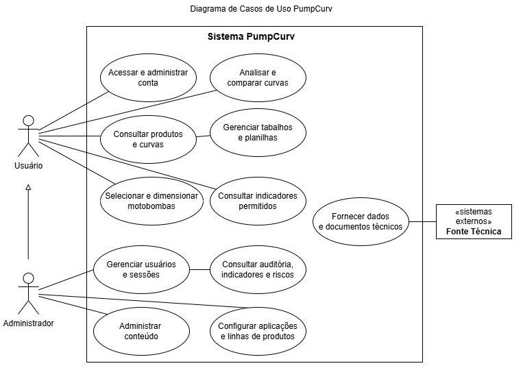
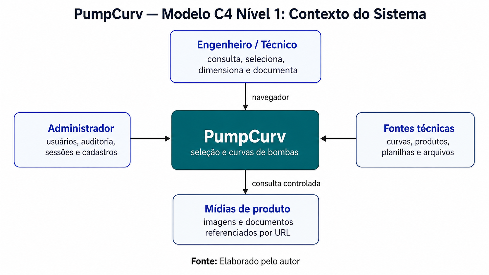
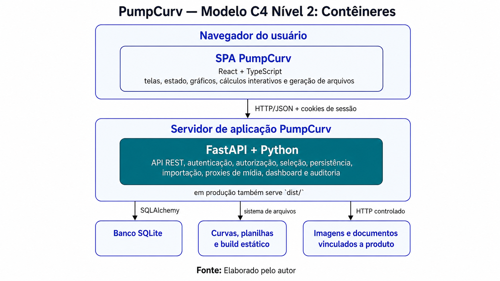
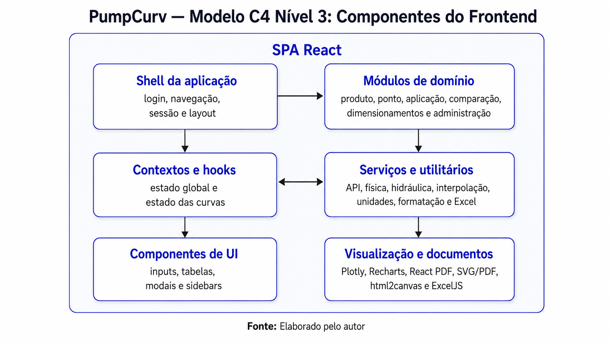
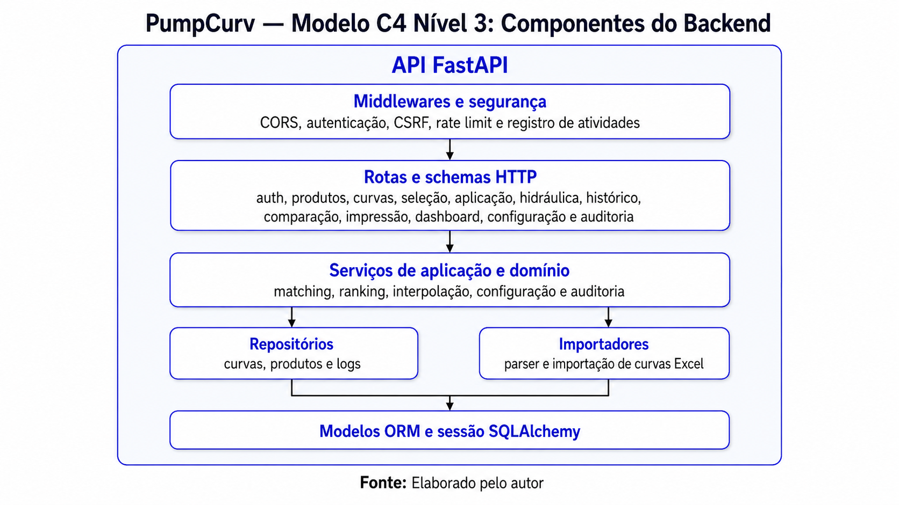
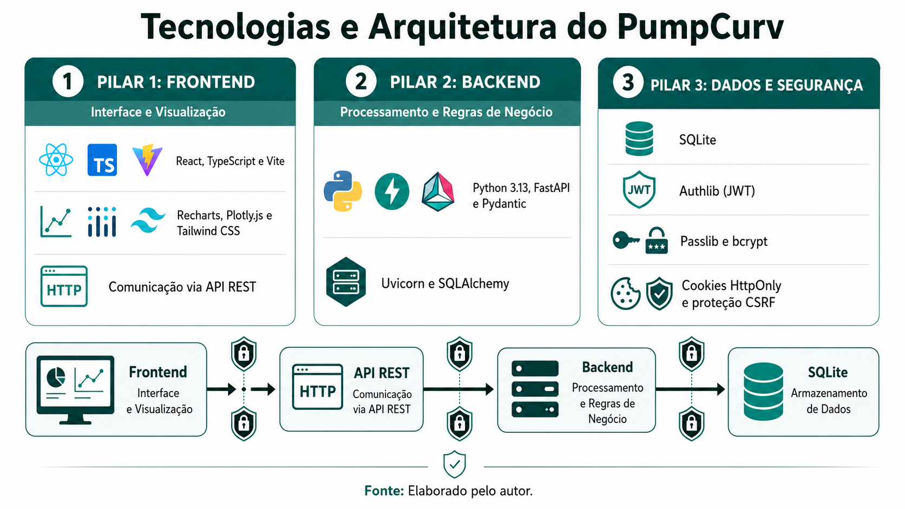

# PumpCurv — Sistema de Seleção e Curvas de Bombas

## Identificação acadêmica

- **Acadêmico**: Jairson Steinert
- **Professor Orientador**: Prof. Dr. Andrei Carniel
- **Curso**: Engenharia de Software
- **Natureza do documento**: RFC — especificação e linha de base do projeto
- **Versão**: 2.0
- **Data de atualização**: 22 de junho de 2026

---

## Resumo

O PumpCurv é uma aplicação web interna voltada à engenharia de aplicação de bombas. A plataforma centraliza a consulta ao catálogo de produtos e às curvas hidráulicas, a seleção de bombas por ponto de operação ou por aplicação, o dimensionamento de sistemas hidráulicos, a comparação técnica entre modelos e a emissão de relatórios.

O sistema utiliza dados de curvas e produtos da Famac Ind. de Máquinas Ltd, equações hidráulicas, interpolação numérica, leis de afinidade e critérios técnicos configuráveis para apoiar a escolha de equipamentos. Também oferece autenticação, controle de acesso, histórico de dimensionamentos e comparações, detecção de trabalhos similares, auditoria e rastreabilidade das impressões.

Esta versão do RFC substitui a proposta anterior de predição do diâmetro de rotores por Machine Learning. O projeto implementado não treina modelos de IA nem produz recomendações por aprendizado de máquina. As recomendações atuais são determinísticas e baseadas em curvas cadastradas, filtros, cálculos hidráulicos, tolerâncias e regras de classificação explicitadas neste documento.

**Palavras-chave**: bombas centrífugas; curvas hidráulicas; seleção de bombas; dimensionamento; NPSH; leis de afinidade; engenharia de software.

---

## 1. Introdução

### 1.1. Contexto

A seleção de bombas exige relacionar o ponto requerido pelo sistema principalmente vazão e altura manométrica total ao desempenho disponível nos modelos do catálogo. O trabalho também pode envolver potência, rendimento, NPSH requerido e disponível, diâmetro de rotor, rotação, número de estágios, características construtivas e restrições da aplicação.

Quando essas informações estão distribuídas entre planilhas, catálogos, arquivos de curvas e cálculos manuais, surgem dificuldades de padronização, rastreabilidade e comparação. O PumpCurv reúne esses elementos em um fluxo único, no qual o usuário pode partir de um produto conhecido, de um ponto de operação ou das características da aplicação.

### 1.2. Mudança de direção do projeto

A proposta inicial investigava o uso de Machine Learning para estimar ajustes de rotores. Durante a evolução do trabalho, o foco passou para um problema mais amplo e imediatamente aplicável: digitalizar e integrar o processo de consulta, seleção, dimensionamento, comparação e documentação técnica de bombas.

A mudança resultou em uma solução baseada em dados técnicos reais do catálogo e em métodos de engenharia verificáveis. O ajuste de curvas é calculado por leis de afinidade; a busca por equipamentos avalia curvas cadastradas; e o ranking usa desvios, tolerâncias e rendimento. Portanto, referências, requisitos, diagramas e metas exclusivamente ligados a treinamento, inferência ou MLOps deixam de fazer parte do escopo vigente.

### 1.3. Justificativa

O PumpCurv busca:

- reduzir o tempo gasto na localização e análise de curvas;
- diminuir erros de transcrição e de comparação manual;
- padronizar cálculos e relatórios entre usuários;
- tornar explícitos os critérios usados na seleção de uma bomba;
- preservar o histórico das decisões técnicas;
- facilitar a reutilização controlada de dimensionamentos já realizados;
- apoiar a governança do sistema com autenticação, auditoria e controle administrativo.

### 1.4. Objetivo geral

Desenvolver uma plataforma web para apoiar, de forma integrada, rastreável e tecnicamente fundamentada, a consulta, seleção, dimensionamento e comparação de bombas e suas curvas de desempenho.

### 1.5. Objetivos específicos

1. Centralizar curvas hidráulicas, produtos e documentos técnicos relacionados.
2. Permitir a consulta de produtos por código, modelo e identificador técnico (IDP).
3. Representar curvas de altura manométrica, potência, rendimento e NPSHr.
4. Calcular ajustes de rotação e diâmetro por leis de afinidade.
5. Localizar bombas compatíveis com um ponto de vazão e altura informado.
6. Guiar o dimensionamento a partir do segmento e da aplicação.
7. Calcular perdas de carga, altura manométrica total, velocidades e NPSH disponível.
8. Comparar múltiplas curvas e ordenar alternativas por critérios técnicos.
9. Gerar relatórios em PDF, impressão técnica e planilhas Excel.
10. Manter histórico, autoria, visibilidade e revisão dos trabalhos salvos.
11. Registrar atividades relevantes para auditoria e gestão.

---

## 2. Escopo do produto

### 2.1. Linha e tema do projeto

- **Linha**: desenvolvimento de software aplicado à engenharia e transformação digital de processos técnicos.
- **Tema**: sistema web para seleção, dimensionamento, análise e comparação de bombas com base em curvas hidráulicas e catálogo de produtos.

### 2.2. Público-alvo

- engenheiros e técnicos responsáveis por seleção e dimensionamento de bombas;
- equipes de aplicação, produto, suporte técnico e vendas técnicas da Famac;
- administradores responsáveis por usuários, auditoria e configuração do sistema.

A aplicação é destinada ao uso interno e depende de dados técnicos e comerciais da organização.

### 2.3. Módulos do PumpCurv

#### 2.3.1. Consulta por Produto

Permite pesquisar por código, modelo ou IDP, carregar a curva correspondente e visualizar dados do conjunto motobomba, motor, materiais, documentos, imagens e informações complementares. O módulo oferece gráficos, tabela de pontos, conversão de unidades, ajuste de curva e geração de relatório técnico.

#### 2.3.2. Seleção por Ponto

Recebe a vazão e a altura manométrica solicitadas, aplica tolerâncias e filtros técnicos e avalia as curvas cadastradas. Os resultados apresentam o desempenho ofertado, os desvios em relação ao ponto solicitado, o rendimento no ponto e um score de adequação. Uma alternativa pode ser enviada diretamente para análise individual ou comparação.

#### 2.3.3. Seleção por Aplicação

Conduz o usuário por segmento e aplicação e restringe a busca às linhas de produtos configuradas. O fluxo inclui assistentes para cenários hidráulicos, como sistemas prediais, piscinas e irrigação, aproveitando o mesmo mecanismo de avaliação de curvas usado na seleção por ponto.

#### 2.3.4. Comparação

Reúne múltiplas curvas em um mesmo ambiente. Permite configurar visibilidade, limites operacionais, ponto de projeto, ajuste numérico, curvas manuais e curva do sistema, além de comparar alternativas e gerar resultados em PDF ou Excel. Comparações podem ser salvas, revisadas, publicadas internamente, arquivadas ou restauradas conforme as permissões do usuário.

#### 2.3.5. Dimensionamentos e histórico

Armazena análises individuais com código, cliente, observações, parâmetros, produto, curva e responsável. O sistema procura dimensionamentos tecnicamente próximos para evitar retrabalho e apoiar a reutilização de conhecimento. Também mantém históricos de comparações, impressões e indicadores de uso.

#### 2.3.6. Administração

Disponibiliza gestão de usuários, ativação e desativação de contas, redefinição de senha, revogação de sessões, consulta de auditoria, registros de aceite de risco e manutenção dos mapeamentos entre aplicações e linhas de produtos.

### 2.4. Diferenciais

- integração entre catálogo, curvas, cálculos hidráulicos e documentação;
- uso de equações segmentadas das curvas, em vez de depender apenas de pontos visualmente aproximados;
- seleção por ponto e por aplicação no mesmo ambiente de análise;
- tratamento de BEP, NPSH, fator de serviço e critérios normativos configuráveis;
- comparação simultânea de curvas de catálogo e curvas informadas manualmente;
- detecção de dimensionamentos similares;
- rastreabilidade de autoria, revisões, impressões e ações administrativas;
- funcionamento sem dependência de serviços externos de inteligência artificial.

### 2.5. Fora do escopo atual

Não fazem parte da linha de base vigente:

- treinamento ou inferência com modelos de Machine Learning;
- otimização de rotores por IA;
- simulação CFD da geometria interna da bomba;
- comando ou controle de bombas em tempo real;
- integração direta com SCADA, CLP, sensores ou telemetria de campo;
- manutenção preditiva;
- substituição da validação final por um engenheiro responsável;
- certificação automática de conformidade normativa;
- disponibilização pública irrestrita do catálogo e dos dados internos.

---

## 3. Requisitos funcionais e não funcionais

### 3.1. RF

Os requisitos funcionais do PumpCurv são apresentados a seguir.

| ID | Requisito | Situação na linha de base |
|---|---|---|
| RF01 | Autenticar usuários e restringir funcionalidades protegidas. | Implementado |
| RF02 | Gerenciar perfil, senha, usuários, papéis e estado das contas. | Implementado |
| RF03 | Pesquisar produtos por código, modelo, IDP e trechos com curinga. | Implementado |
| RF04 | Carregar curvas do banco ou de arquivos Excel compatíveis. | Implementado |
| RF05 | Exibir curvas de AMT, potência, rendimento e NPSHr com tabela de pontos. | Implementado |
| RF06 | Ajustar curvas por rotação, diâmetro e número de bombas, preservando os dados originais. | Implementado |
| RF07 | Identificar o BEP e apresentar a posição do ponto de operação em relação a ele. | Implementado |
| RF08 | Calcular e exibir NPSH disponível e comparar com o NPSH requerido. | Implementado |
| RF09 | Buscar bombas por ponto de operação, tolerâncias e filtros de produto. | Implementado |
| RF10 | Classificar as alternativas pelo atendimento ao ponto e pelo rendimento. | Implementado |
| RF11 | Selecionar bombas por segmento e aplicação usando linhas previamente mapeadas. | Implementado |
| RF12 | Calcular perdas na sucção e no recalque, velocidades, AMT e sugestão de tubulação. | Implementado |
| RF13 | Comparar múltiplas curvas e aceitar curvas criadas manualmente. | Implementado |
| RF14 | Gerar relatório técnico, PDF e exportações Excel. | Implementado |
| RF15 | Salvar e recuperar dimensionamentos, comparações e revisões. | Implementado |
| RF16 | Detectar dimensionamentos similares e informar o grau de proximidade. | Implementado |
| RF17 | Controlar visibilidade, solicitações de acesso, arquivamento e restauração. | Implementado |
| RF18 | Registrar impressões e ações relevantes dos usuários. | Implementado |
| RF19 | Exibir painel de indicadores e relatórios de auditoria para administradores. | Implementado |
| RF20 | Permitir a manutenção administrativa dos vínculos entre aplicações e linhas de produtos. | Implementado |

### 3.2. RNF

Os requisitos não funcionais do PumpCurv são apresentados a seguir.

| ID | Requisito | Categoria | Situação |
|---|---|---|---|
| RNF01 | Utilizar autenticação, autorização por papel e proteção das sessões. | Segurança | Implementado |
| RNF02 | Não registrar credenciais ou conteúdo sensível nos logs de auditoria. | Segurança | Implementado no desenho de auditoria |
| RNF03 | Manter rastreabilidade de autoria e data nos trabalhos persistidos. | Rastreabilidade | Implementado |
| RNF04 | Preservar consistência de unidades e formatação técnica entre tela e relatório. | Confiabilidade | Implementado; sujeito a testes de regressão |
| RNF05 | Oferecer interface utilizável em diferentes resoluções. | Usabilidade | Implementado; validação contínua |
| RNF06 | Separar interface, API, regras de negócio e persistência. | Manutenibilidade | Implementado |
| RNF07 | Validar entradas no frontend e na API antes do processamento. | Robustez | Implementado nos fluxos principais |
| RNF08 | Manter tempos de consulta adequados ao uso interativo no ambiente interno. | Desempenho | Otimizado; deve ser medido no ambiente final |
| RNF09 | Permitir reconstrução do frontend e execução reproduzível da API por dependências declaradas. | Portabilidade | Implementado |
| RNF10 | Manter documentação dos cálculos e regras críticas. | Manutenibilidade | Em evolução |
| RNF11 | Restringir dados internos ao ambiente e aos usuários autorizados. | Confidencialidade | Depende também da implantação |
| RNF12 | Não apresentar o resultado computacional como substituto da responsabilidade técnica. | Segurança operacional | Regra de uso |

### 3.3. Atores e casos de uso

O diagrama apresenta uma visão resumida das interações com o PumpCurv. Os casos de uso foram agrupados por finalidade para manter a legibilidade, enquanto seus fluxos detalhados permanecem descritos nos requisitos funcionais e nas seções técnicas deste RFC.

| Ator | Responsabilidade principal |
|---|---|
| **Usuário** | Acessar sua conta e executar os fluxos técnicos, documentais e de consulta permitidos. |
| **Administrador** | Executar os casos de uso do Usuário e acrescentar funções de gestão e governança. |
| **Fonte técnica interna** | Disponibilizar os dados e documentos técnicos consumidos pelo sistema. |

```text
Usuário
 ├─ acessar e administrar sua conta
 ├─ consultar produtos e curvas
 ├─ selecionar e dimensionar motobombas
 ├─ analisar e comparar curvas
 ├─ gerenciar trabalhos e planilhas
 └─ consultar indicadores permitidos

Administrador
 ├─ gerenciar usuários e sessões
 ├─ consultar auditoria, indicadores e aceites de risco
 ├─ administrar conteúdo
 └─ configurar aplicações e linhas de produtos

Fonte técnica interna
 └─ fornecer dados e documentos técnicos
```
*Figura 1 – Diagrama de Casos de Uso do PumpCurv.*  


*Fonte: Elaborado pelo autor.*

O **Administrador** é uma especialização do Usuário e, por generalização, herda todos os seus casos de uso. A **Fonte técnica interna** é externa à fronteira do PumpCurv e fornece catálogo, curvas, equações, planilhas, imagens e documentos. O acesso aos trabalhos continua condicionado à autenticação, autoria, visibilidade e permissões aplicáveis.


### 3.4. Fluxos principais

#### Fluxo A — seleção por ponto

1. O usuário informa vazão, altura e tolerâncias.
2. Opcionalmente, aplica filtros como rotação, categoria, alimentação, frequência, rotor e passagem de sólidos.
3. A API avalia as equações das curvas elegíveis.
4. O sistema calcula o desempenho ofertado, os desvios, o rendimento e o score.
5. Os resultados são ordenados e apresentados com seus dados técnicos.
6. O usuário envia uma opção para consulta detalhada ou comparação.

#### Fluxo B — dimensionamento por aplicação

1. O usuário escolhe segmento e aplicação.
2. O sistema carrega o assistente e as linhas de produto permitidas.
3. As entradas hidráulicas originam o ponto de operação.
4. A busca avalia somente produtos compatíveis com o mapeamento e os filtros.
5. A opção escolhida segue para análise, ajuste, relatório e salvamento.

#### Fluxo C — comparação e documentação

1. O usuário adiciona curvas do catálogo ou cria uma curva manual.
2. Define ponto de projeto, unidades, limites e critérios de visualização.
3. Analisa as curvas sobrepostas e o ranking técnico.
4. Salva a comparação ou uma nova revisão.
5. Exporta o resultado em PDF, impressão ou planilha Excel.

---

## 4. Arquitetura atual

### 4.1. Visão geral

O PumpCurv adota uma arquitetura de **monólito web modular**, adequada ao uso interno e à implantação atual. A solução é formada por uma aplicação de página única no navegador, uma API HTTP que concentra autenticação e regras de negócio, um banco relacional local e fontes de arquivos técnicos. Em produção, o mesmo processo FastAPI também pode servir o build estático do frontend, reduzindo a quantidade de serviços necessários.

A arquitetura não é composta apenas pelo frontend e pelo backend. Ela inclui camadas específicas de apresentação, estado, cálculos de engenharia, serviços de aplicação, segurança, auditoria, persistência, importação e integração com arquivos e mídias de produto.

### 4.2. Modelo C4 — Nível 1: contexto do sistema

Neste nível, o PumpCurv é representado como um único sistema. Frontend, API e banco são detalhes internos apresentados nos níveis seguintes.

```text
                             ┌───────────────────────────┐
                             │ Engenheiro / Técnico      │
                             │ consulta, seleciona,      │
                             │ dimensiona e documenta    │
                             └─────────────┬─────────────┘
                                           │ navegador
                                           ▼
┌──────────────────────┐     ┌─────────────────────────────┐     ┌──────────────────────┐
│ Administrador        │────►│          PumpCurv           │◄────│ Fontes técnicas      │
│ usuários, auditoria, │     │ seleção e curvas de bombas  │     │ curvas, produtos,    │
│ sessões e cadastros  │     └──────────────┬──────────────┘     │ planilhas e arquivos │
└──────────────────────┘                    │                    └──────────────────────┘
                                            │ consulta controlada
                                            ▼
                                 ┌────────────────────────┐
                                 │ Mídias de produto      │
                                 │ imagens e documentos   │
                                 │ referenciados por URL  │
                                 └────────────────────────┘
```

*Figura 2 – Diagrama C4, Nível 1: Contexto do Sistema PumpCurv.*  



*Fonte: Elaborado pelo autor.*

#### Pessoas e sistemas relacionados

| Elemento | Relação com o PumpCurv |
|---|---|
| Engenheiro ou técnico | Executa consultas, cálculos, seleções, comparações e relatórios. |
| Administrador | Gerencia contas, sessões, auditoria, riscos e mapeamentos de aplicação. |
| Fontes técnicas internas | Fornecem curvas, catálogo, produtos, tabelas hidráulicas e arquivos Excel. |
| Repositórios de mídia | Fornecem imagens, fichas técnicas, documentos e QR Codes vinculados aos produtos. |

### 4.3. Modelo C4 — Nível 2: contêineres

```text
┌────────────────────────────────────────────────────────────────────────────┐
│ Navegador do usuário                                                       │
│                                                                            │
│  ┌──────────────────────────────────────────────────────────────────────┐  │
│  │ SPA PumpCurv                                                         │  │
│  │ React + TypeScript                                                   │  │
│  │ telas, estado, gráficos, cálculos interativos e geração de arquivos  │  │
│  └───────────────────────────────┬──────────────────────────────────────┘  │
└──────────────────────────────────┼─────────────────────────────────────────┘
                                   │ HTTP/JSON
                                   ▼
┌────────────────────────────────────────────────────────────────────────────┐
│ Servidor de aplicação PumpCurv                                             │
│                                                                            │
│  ┌──────────────────────────────────────────────────────────────────────┐  │
│  │ FastAPI + Python                                                     │  │
│  │ API REST, regras de negócio, seleção, persistência, importação,      │  │
│  │ indicadores, controle de acesso e auditoria                          │  │
│  └──────────────┬────────────────────┬─────────────────────┬────────────┘  │
│                 │                    │                     │               │
│                 │ em produção também disponibiliza a interface web         │
└─────────────────┼────────────────────┼─────────────────────┼───────────────┘
                  │ persistência       │ arquivos técnicos   │ mídias permitidas
                  ▼                    ▼                     ▼
        ┌─────────────────┐  ┌────────────────────┐  ┌─────────────────────┐
        │ Banco SQLite    │  │ Curvas, planilhas  │  │ Imagens e documentos│
        │                 │  │ e build estático   │  │ vinculados a produto│
        └─────────────────┘  └────────────────────┘  └─────────────────────┘
```

*Figura 3 – Diagrama C4, Nível 2: Contêineres do PumpCurv.*  



*Fonte: Elaborado pelo autor.*

#### Responsabilidades dos contêineres

| Contêiner | Responsabilidades | Tecnologia principal |
|---|---|---|
| SPA no navegador | Navegação, formulários, gráficos, estado da análise, cálculos interativos, PDF e Excel. | React, TypeScript e Vite |
| Servidor de aplicação | API, autenticação, regras de seleção, acesso a dados, auditoria, importação e entrega do frontend compilado. | FastAPI e Python |
| Banco de dados | Catálogo, curvas, equações, usuários, trabalhos salvos, logs e tabelas de referência. | SQLite e SQLAlchemy |
| Sistema de arquivos | Entrada de planilhas/curvas, arquivos técnicos e artefatos estáticos da aplicação. | Diretórios controlados pelo servidor |
| Serviços de mídia | Origem de imagens e documentos referenciados no catálogo. | HTTP/HTTPS por URLs permitidas |

### 4.4. Modelo C4 — Nível 3: componentes do frontend

```text
┌──────────────────────────── SPA React ───────────────────────────────────┐
│                                                                          │
│  ┌────────────────────┐    ┌──────────────────────────────────────────┐  │
│  │ Shell da aplicação │───►│ Módulos de domínio                       │  │
│  │ login, navegação,  │    │ produto, ponto, aplicação, comparação,   │  │
│  │ sessão e layout    │    │ dimensionamentos e administração         │  │
│  └─────────┬──────────┘    └───────────────────┬──────────────────────┘  │
│            │                                   │                         │
│            ▼                                   ▼                         │
│  ┌────────────────────┐    ┌──────────────────────────────────────────┐  │
│  │ Contextos e hooks  │◄──►│ Serviços e utilitários                   │  │
│  │ estado global e    │    │ API, física, hidráulica, interpolação,   │  │
│  │ estado das curvas  │    │ unidades, formatação e Excel             │  │
│  └─────────┬──────────┘    └───────────────────┬──────────────────────┘  │
│            │                                   │                         │
│            ▼                                   ▼                         │
│  ┌────────────────────┐    ┌──────────────────────────────────────────┐  │
│  │ Componentes de UI  │    │ Visualização e documentos                │  │
│  │ inputs, tabelas,   │    │ Plotly, Recharts, React PDF, SVG/PDF,    │  │
│  │ modais e sidebars  │    │ html2canvas e ExcelJS                    │  │
│  └────────────────────┘    └──────────────────────────────────────────┘  │
└──────────────────────────────────────────────────────────────────────────┘
```

*Figura 4 – Diagrama C4, Nível 3: Componentes do Frontend.*  



*Fonte: Elaborado pelo autor.*

#### Componentes principais

- **Shell e navegação**: autenticação obrigatória, seleção do módulo, restauração de sessão e navegação pelo histórico do navegador.
- **Consulta por Produto**: pesquisa de catálogo, carregamento da curva e composição das informações de bomba e motor.
- **Seleção por Ponto**: entradas, tolerâncias, filtros, resultados e entrega da opção selecionada aos demais módulos.
- **Seleção por Aplicação**: assistentes hidráulicos e fluxo guiado por segmento e aplicação.
- **Comparação**: estado multicurvas, curvas manuais, ponto de projeto, ranking, gráfico e revisões salvas.
- **Dimensionamentos**: histórico, trabalhos similares, solicitações de acesso, impressão e recuperação.
- **Administração**: usuários, auditoria, riscos e mapeamentos de linhas de produto.
- **Contextos**: `AuthContext` mantém identidade e sessão; `ConfigContext` distribui configurações compartilhadas.
- **Hooks de domínio**: `usePumpData`, `useMultiCurves`, `usePointSelection`, `useIdleTimeout` e `useResizableColumns` encapsulam estado e comportamento reutilizável.
- **Camada de serviços**: centraliza chamadas HTTP, tratamento de fluidos e contratos consumidos pela interface.
- **Utilitários técnicos**: concentram leis de afinidade, interpolação, hidráulica, conversão de unidades, rótulos e exportação Excel.

Os módulos de maior porte são carregados sob demanda com `lazy`, reduzindo o custo inicial da aplicação. O frontend conserva no navegador apenas estados necessários à experiência de uso; dados permanentes são enviados à API.

### 4.5. Modelo C4 — Nível 3: componentes do backend

```text
┌────────────────────────── API FastAPI ───────────────────────────────────┐
│                                                                          │
│  ┌────────────────────────────────────────────────────────────────────┐  │
│  │ Controles transversais                                             │  │
│  │ autenticação, autorização, validação e auditoria                    │  │
│  └──────────────────────────────┬─────────────────────────────────────┘  │
│                                 ▼                                        │
│  ┌────────────────────────────────────────────────────────────────────┐  │
│  │ Interfaces da aplicação e contratos de dados                       │  │
│  │ produtos, curvas, seleção, hidráulica, trabalhos e indicadores     │  │
│  └──────────────────────────────┬─────────────────────────────────────┘  │
│                                 ▼                                        │
│  ┌────────────────────────────────────────────────────────────────────┐  │
│  │ Serviços de aplicação e domínio                                    │  │
│  │ matching, ranking, interpolação, configuração e auditoria          │  │
│  └──────────────────────────────┬─────────────────────────────────────┘  │
│                                 ▼                                        │
│  ┌────────────────────────┐   ┌───────────────────────────────────────┐  │
│  │ Repositórios           │   │ Importadores                          │  │
│  │ curvas, produtos e logs│   │ parser e importação de curvas Excel   │  │
│  └────────────┬───────────┘   └───────────────────┬───────────────────┘  │
│               └──────────────────────┬────────────┘                      │
│                                      ▼                                   │
│  ┌────────────────────────────────────────────────────────────────────┐  │
│  │ Modelos ORM e sessão SQLAlchemy                                    │  │
│  └────────────────────────────────────────────────────────────────────┘  │
└──────────────────────────────────────────────────────────────────────────┘
```

*Figura 5 – Diagrama C4, Nível 3: Componentes do Backend.*  



*Fonte: Elaborado pelo autor.*

#### Organização real do backend

O backend está em processo de modularização. Os principais domínios já possuem responsabilidades separadas, enquanto funções transversais e fluxos legados continuam sendo reorganizados progressivamente.

Essa observação é importante: a arquitetura aplica separação em camadas, mas ainda não é uniformemente modular em todo o backend. A evolução recomendada é ampliar gradualmente essa divisão sem alterar os contratos funcionais consumidos pela interface.

### 4.6. Arquitetura de dados

O PumpCurv utiliza SQLite com mapeamento SQLAlchemy. A arquitetura descrita a seguir é um **modelo físico simplificado** das entidades principais: apresenta as tabelas realmente existentes e diferencia relacionamentos por chave estrangeira, associações lógicas e dados incorporados em JSON.

#### Convenções de relacionamento

| Representação | Significado |
|---|---|
| Linha contínua | Relacionamento físico por chave estrangeira (FK) |
| Linha tracejada | Associação lógica por código, sem FK no banco |
| Linha pontilhada | Referência desnormalizada armazenada em `snapshot_json` |
| `0..1` | Registro relacionado opcional |
| `1` | Exatamente um registro |
| `N` | Vários registros |

#### Grupos de dados

| Grupo | Conteúdo principal |
|---|---|
| Engenharia e catálogo | produtos, curvas de bombas e quatro tabelas de equações hidráulicas |
| Referências hidráulicas | fluidos, materiais, diâmetros, comprimentos equivalentes, pressões e normas |
| Trabalho do usuário | snapshots de dimensionamentos, comparações e impressões, além das solicitações de acesso |
| Segurança e governança | usuários, sessões revogadas, logs de atividade e aceites de risco |

O dashboard não constitui uma entidade própria: seus indicadores são agregados a partir das tabelas de usuários, dimensionamentos, comparações e impressões.

#### Relacionamentos físicos por chave estrangeira

| Origem | Cardinalidade | Destino | Chave/observação |
|---|---:|---|---|
| `users` | 1:N | `dimensionamentos` | `owner_user_id` |
| `users` | 1:N | `comparacoes_salvas` | `owner_user_id` |
| `users` | 1:N | `print_logs` | `owner_user_id` |
| `users` | 1:N | `access_requests` | dois papéis: `requester_id` e `owner_id` |
| `dimensionamentos` | 1:N | `access_requests` | `dimensionamento_id` obrigatório |
| `dimensionamentos` | 1:0..N | `print_logs` | `dimensionamento_id` é opcional no registro de impressão |
| `print_logs` | 1:0..N | `print_logs` | autorrelacionamento de reimpressão por `source_print_log_id` |
| `users` | 0..1:N | `user_activity_logs` | `user_id` pode ser nulo para preservar o log |
| `users` | 0..1:N | `session_revocations` | usuário afetado e administrador responsável |
| `users` | 0..1:N | `risk_acceptance_logs` | `user_id` pode ser nulo |

Dimensionamentos e comparações também possuem FKs secundárias para registrar quem alterou visibilidade, editou, arquivou, bloqueou ou excluiu um item. Essas relações de auditoria podem ser omitidas no diagrama resumido para preservar a legibilidade, desde que sejam mencionadas em sua legenda.

#### Snapshots dos trabalhos

`dimensionamentos`, `comparacoes_salvas` e `print_logs` preservam o estado técnico do trabalho em `snapshot_json`. Portanto:

- `dimensionamentos` não possui `produto_id`, `curva_id` ou `aplicacao_id`;
- produto, curva, aplicação, entradas e resultados são cópias desnormalizadas dentro do snapshot;
- `comparacoes_salvas` não possui uma tabela filha de revisões;
- a comparação é atualizada na própria linha, usando `snapshot_json`, `last_revision_description` e `last_edited_at`;
- `print_logs` conserva o conteúdo impresso em seu próprio snapshot, permitindo rastreabilidade mesmo após mudanças no catálogo.

As ligações entre snapshots, produtos e curvas devem ser representadas por linhas pontilhadas, pois não há integridade referencial entre esses conteúdos JSON e as tabelas de catálogo.

#### Produtos e curvas de bombas

`produto` e `pump_curves` são associados pelo identificador técnico `cd_idp`. Esse vínculo não possui FK e o campo não é exclusivo nas duas tabelas. Uma curva pode corresponder a diferentes variações comerciais de produto, e um mesmo IDP pode aparecer em mais de um registro de curva.

```text
produto 0..N - - - 0..N pump_curves
             cd_idp
        associação lógica, sem FK
```

#### Curvas e tabelas de equações

Não existe uma tabela genérica chamada “Equações segmentadas”. Cada curva pode possuir até um registro em cada uma das quatro tabelas abaixo:

| Tabela | Conteúdo | Segmentos armazenados |
|---|---|---|
| `DIEQUACOES_ALTURA` | Equação de altura manométrica | P1 a P4 |
| `DIEQUACOES_NPSH` | Equação de NPSH requerido | P1 |
| `DIEQUACOES_POTENCIA` | Equação de potência | P1 a P4 |
| `DIEQUACOES_RENDIMENTO` | Equação de rendimento | P1 a P4 |

O relacionamento é configurado no ORM por igualdade entre `pump_curves.codigo` e o campo `CODIGO`, que é a chave primária de cada tabela de equação. Não existe FK física declarada nessas colunas.

```text
pump_curves 1 - - - 0..1 DIEQUACOES_ALTURA
            1 - - - 0..1 DIEQUACOES_NPSH
            1 - - - 0..1 DIEQUACOES_POTENCIA
            1 - - - 0..1 DIEQUACOES_RENDIMENTO

            vínculo lógico: pump_curves.codigo = tabela.CODIGO
```

#### Aplicações e linhas de produto

Não existem tabelas independentes chamadas `aplicacao` ou `linha_produto`. O mapeamento é armazenado diretamente em `aplicacao_linha_produto`, com os campos:

- `segmento`;
- `nome_aplicacao`;
- `cd_linha`;
- `criado_em`.

A seleção por aplicação compara `aplicacao_linha_produto.cd_linha` com `produto.cd_linha`. Trata-se de uma associação lógica N:N, sem FK.

```text
aplicacao_linha_produto N - - - N produto
                        cd_linha
                 associação lógica, sem FK
```

#### Referências hidráulicas

As tabelas de referência são consultadas pelos serviços de cálculo e não possuem relacionamento direto com dimensionamentos:

- `fluidos_npsh`;
- `material_tubulacao`;
- `diametro_velocidade`;
- `leq_conexao`;
- `flamant_perda`;
- `pressao_atmosferica`;
- `pressao_vapor`;
- `sugestao_bitola`;
- `golpe_ariete`;
- `norma_tecnica`;
- `compatibilidade_quimica`;
- `selo_mecanico`;
- `glossario_material`;
- `nbr5626_peso`.

#### Visão consolidada

```text
[Relacionamentos físicos — FK]
users 1 ─── N dimensionamentos
users 1 ─── N comparacoes_salvas
users 1 ─── N print_logs
users 1 ─── N access_requests
dimensionamentos 1 ─── N access_requests
dimensionamentos 1 ─── 0..N print_logs
print_logs 1 ─── 0..N print_logs (reimpressões)

[Associações lógicas — sem FK]
produto 0..N - - - 0..N pump_curves                    [cd_idp]
pump_curves 1 - - - 0..1 cada tabela de equação        [codigo/CODIGO]
aplicacao_linha_produto N - - - N produto               [cd_linha]

[Snapshots — sem FK]
dimensionamentos . . . produto/curva/aplicação           [snapshot_json]
comparacoes_salvas . . . curvas e estado da comparação   [snapshot_json]
print_logs . . . conteúdo técnico impresso               [snapshot_json]
```

A persistência é gerenciada pela aplicação conforme o ciclo das solicitações. Como parte dos vínculos depende de códigos e snapshots, normalização, validação de importação e verificação periódica de consistência são responsabilidades importantes do sistema. Parâmetros internos de conexão e concorrência permanecem restritos ao ambiente de desenvolvimento e implantação.

### 4.7. Fluxos arquiteturais críticos

#### 4.7.1. Operação com controle de acesso

```text
Navegador
  │ solicitação do usuário
  ▼
Verificação de identidade e contexto
  ▼
Validação de autorização
  ▼
Serviço de aplicação
  ▼
Regra de negócio e persistência
  ▼
Resposta e registro da atividade
```

#### 4.7.2. Seleção por ponto ou aplicação

```text
Entradas e filtros no frontend
  ▼
POST para a API de seleção
  ▼
Consulta de curvas e produtos elegíveis
  ▼
Avaliação/interpolação das equações
  ▼
Cálculo de desvios, rendimento e score
  ▼
Ordenação e resposta tipada
  ▼
Tabela de resultados
  ▼
Análise individual ou comparação
```

#### 4.7.3. Persistência e rastreabilidade

```text
Estado técnico da análise
  ▼
Validação e serialização pela API
  ▼
Dimensionamento, comparação ou impressão persistida
  ├── autoria e timestamps
  ├── visibilidade e status
  ├── código/revisão
  └── registro de auditoria
```

### 4.8. Arquitetura de segurança

A segurança é distribuída entre a interface, os controles de aplicação, as regras de domínio e a persistência. A tabela apresenta somente os objetivos de proteção; mecanismos e parâmetros internos não são publicados:

| Camada | Controles atuais |
|---|---|
| Interface | preservação do estado necessário à experiência sem exposição de credenciais |
| Comunicação | proteção do tráfego e controle das origens conforme o ambiente de implantação |
| Aplicação | autenticação, validação de entrada e proteção das operações restritas |
| Autorização | verificação de usuário ativo, perfil, autoria, visibilidade e permissão sobre os trabalhos |
| Integrações externas | validação das origens e dos conteúdos consumidos pelo sistema |
| Persistência | proteção das credenciais, rastreabilidade e preservação do histórico nos fluxos aplicáveis |

Os detalhes de implementação desses controles são mantidos na documentação interna e devem ser revistos sempre que a topologia de implantação for alterada.

### 4.9. Arquitetura de implantação

#### Desenvolvimento e produção interna

```text
Navegador ──► aplicação web ──► serviço backend ──► persistência
```

A interface é compilada para recursos estáticos e pode ser disponibilizada junto ao serviço backend no ambiente interno. Endereços, portas, caminhos e configurações físicas de implantação não fazem parte desta documentação.

### 4.10. Decisões e limitações arquiteturais

| Decisão atual | Benefício | Limitação ou ponto de evolução |
|---|---|---|
| Monólito web modular | Implantação e operação simples | Crescimento exige disciplina de modularização |
| SPA React | Experiência interativa rica | `App.tsx` ainda concentra coordenação significativa |
| FastAPI servindo API e frontend | Menos componentes em produção | Escala conjunta interface e API |
| SQLite | Baixo custo operacional e portabilidade | Limites de escrita concorrente e alta disponibilidade |
| Cálculos também no frontend | Resposta imediata e gráficos interativos | Regras críticas precisam de testes para evitar divergência com a API |
| Importação por planilhas | Compatibilidade com o processo existente | Qualidade depende da estrutura e validação dos arquivos |
| Auditoria no banco da aplicação | Rastreabilidade integrada | Não substitui observabilidade externa, métricas ou APM |
| Rate limiting em memória | Proteção simples para uma instância | Não é compartilhado entre réplicas |

### 4.11. Princípios arquiteturais

- separação entre apresentação, estado, comunicação, domínio e persistência;
- contratos HTTP tipados e validação de entrada;
- componentes funcionais e tipagem estática no frontend;
- routers, Service Layer e Repository Pattern nos domínios modularizados;
- injeção de dependências para banco e autenticação;
- carregamento tardio de módulos de interface;
- preservação de histórico por revisão, arquivamento, restauração e soft delete;
- cálculos determinísticos e critérios técnicos explicitáveis;
- evolução incremental, evitando a introdução prematura de serviços distribuídos.

---

## 5. Regras técnicas e cálculos

### 5.1. Representação das curvas

As curvas hidráulicas são armazenadas por identificação do produto e por trechos de equações polinomiais com faixas de aplicação. Pontos podem ser gerados para visualização, interpolação e relatórios, mas a fonte técnica cadastrada mantém a estrutura segmentada da curva.

O sistema trabalha principalmente com:

- vazão \(Q\);
- altura manométrica \(H\);
- potência absorvida \(P\);
- rendimento \(\eta\);
- NPSH requerido, ou NPSHr.

### 5.2. Leis de afinidade

Para a razão de rotação \(n=N_2/N_1\) e a razão de diâmetro \(d=D_2/D_1\), a implementação atual calcula:

```math
Q_2 = Q_1 \cdot n \cdot d
```

```math
H_2 = H_1 \cdot n^2 \cdot d^2
```

```math
P_2 = P_1 \cdot n^3 \cdot d^3
```

O rendimento é mantido aproximadamente constante no ponto homólogo. Na linha de base atual, a curva NPSHr × Q é preservada e o NPSHr é obtido por interpolação na vazão ajustada. Esses resultados são aproximações de engenharia e precisam respeitar limites construtivos e operacionais do produto.

### 5.3. Curvas em série e em paralelo

- **Série**: para a mesma vazão, as alturas das bombas são somadas.
- **Paralelo**: para a mesma altura, as vazões das bombas são somadas.

O recurso gera uma curva composta para comparação e não representa, por si só, a análise completa da instalação.

### 5.4. Seleção e ranking

Para cada curva elegível, o backend avalia o ponto solicitado e verifica os desvios dentro das tolerâncias configuradas. O score atual pondera:

- 47,5% para atendimento de altura;
- 47,5% para atendimento de vazão;
- 5% para rendimento como critério de desempate.

Erros por sobreoferta e suboferta recebem tratamento assimétrico. O score organiza alternativas; ele não declara automaticamente que uma bomba está aprovada para todas as condições da aplicação.

### 5.5. Perdas de carga e altura manométrica total

O cálculo hidráulico considera trechos de sucção e recalque, comprimentos reais e equivalentes, material e idade da tubulação, diâmetro interno, conexões, margem adicional de singularidades, altura geométrica e pressão de serviço.

A forma geral utilizada é:

```math
H_{total} = H_{geométrica} + H_{sucção} + h_{f,sucção} + h_{f,recalque} + H_{serviço}
```

As perdas distribuídas são calculadas por Hazen-Williams nos fluxos implementados. O sistema também calcula velocidades e pode sugerir bitola a partir das tabelas de referência cadastradas.

### 5.6. NPSH disponível

Quando altitude, temperatura e condição de sucção são informadas, o NPSH disponível é calculado por:

```math
NPSH_a = H_{atm} - H_{vapor} + H_{sucção} - h_{f,sucção}
```

A pressão atmosférica e a pressão de vapor são interpoladas nas tabelas de referência. O resultado é confrontado com o NPSHr da curva e deve ser interpretado com a margem de segurança definida pelo responsável técnico.

### 5.7. BEP e fator de serviço

O BEP é identificado pelo maior rendimento disponível na curva. O sistema informa a distância do ponto de operação em relação ao BEP e sinaliza faixas configuráveis.

O fator de serviço do motor é usado para calcular a potência utilizável e o limite de operação:

```math
P_{utilizável} = P_{nominal} \cdot FS
```

O limite pode ser exibido nos gráficos e relatórios para apoiar a verificação de reserva de potência.

### 5.8. Critérios normativos configuráveis

O PumpCurv possui apoio à verificação de critérios percentuais associados à NFPA 20 e à ABNT NBR 16704. A configuração pode verificar altura em alta vazão e altura máxima em shutoff a partir do ponto de operação.

Essa funcionalidade não reproduz integralmente as normas, não cobre todos os seus requisitos e não constitui certificação. A edição oficial vigente deve ser consultada pelo profissional responsável.

---

## 6. Segurança, privacidade e rastreabilidade

### 6.1. Controles implementados

- proteção das credenciais e das sessões;
- autenticação e controle de acesso por usuário e perfil;
- verificação de autoria, visibilidade e permissão sobre os trabalhos;
- validação das entradas e das operações solicitadas;
- rastreabilidade de atividades e ações relevantes;
- bloqueio, arquivamento, restauração e preservação do histórico em fluxos críticos;
- configurações de segurança mantidas fora da documentação pública.

### 6.2. Privacidade e LGPD

O sistema trata dados de identificação profissional, como nome, usuário, e-mail, telefone, cargo e registros de atividade. O uso deve observar finalidade, necessidade, controle de acesso, retenção e segurança compatíveis com a Lei Geral de Proteção de Dados Pessoais.

Os dados técnicos de produtos, curvas e projetos também possuem caráter interno. A confidencialidade efetiva depende da configuração segura do ambiente, das permissões, das rotinas de continuidade e das políticas organizacionais.

### 6.3. Responsabilidade técnica

O PumpCurv é uma ferramenta de apoio. O resultado deve ser conferido por profissional habilitado, sobretudo em aplicações críticas, combate a incêndio, fluidos especiais, operação fora da faixa recomendada e situações em que falhas possam causar risco humano, ambiental ou patrimonial.

---

## 7. Stack tecnológica

*Figura 6 – Tecnologias e Arquitetura do PumpCurv.*  



*Fonte: Elaborado pelo autor.*

### 7.1. Frontend

| Tecnologia | Uso no projeto |
|---|---|
| React 19 + TypeScript | Interface e tipagem da aplicação |
| Vite 6 | Desenvolvimento e build |
| Tailwind CSS 4 | Estilização |
| Plotly e Recharts | Gráficos técnicos e indicadores |
| React PDF, svg2pdf e html2canvas | Relatórios vetoriais e rasterizados |
| ExcelJS | Importação e exportação de planilhas |
| Lucide React | Ícones da interface |

### 7.2. Backend

| Tecnologia | Uso no projeto |
|---|---|
| Python | Linguagem do servidor e scripts de dados |
| FastAPI + Uvicorn | API web |
| SQLAlchemy | Persistência ORM |
| Pydantic | Validação e serialização |
| SQLite | Banco da linha de base |
| NumPy e SciPy | Processamento e interpolação numérica |
| pandas e openpyxl | Tratamento e importação de planilhas |
| Bibliotecas de segurança | Proteção de identidade, credenciais e sessões |
| Segno | Geração de QR Codes |

### 7.3. Estrutura de implantação

O frontend é compilado para arquivos estáticos e a API pode servir a aplicação no ambiente interno. Configurações sensíveis permanecem externas ao código e restritas ao ambiente de implantação. O banco SQLite atende à linha de base atual; crescimento de volume, concorrência ou disponibilidade poderá justificar migração para um SGBD servidor.

---

## 8. Qualidade e validação

### 8.1. Estratégia de validação

A validação do PumpCurv deve combinar:

1. conferência dos resultados com curvas e catálogos de referência;
2. comparação de cálculos hidráulicos com planilhas ou cálculos independentes;
3. testes de fluxos de autenticação e permissão;
4. testes de regressão em importação, unidades, ajustes e exportações;
5. avaliação com engenheiros e técnicos usuários;
6. verificação de relatórios em tela, PDF, impressão e Excel;
7. medição de desempenho no ambiente de implantação.

### 8.2. Métricas propostas

| Dimensão | Métrica |
|---|---|
| Correção | Concordância dos resultados com casos de referência aprovados |
| Eficiência operacional | Redução do tempo médio de seleção e preparação do relatório |
| Usabilidade | Taxa de conclusão das tarefas e avaliação dos usuários |
| Desempenho | Tempo de resposta das buscas e geração de documentos |
| Rastreabilidade | Percentual de ações e documentos críticos associados a usuário e data |
| Confiabilidade | Quantidade de defeitos encontrados após liberação |
| Adoção | Usuários ativos e dimensionamentos realizados no período |

As metas numéricas devem ser definidas após a coleta de uma linha de base no ambiente real. Este RFC não declara resultados de desempenho ou precisão ainda não medidos.

### 8.3. Limitações atuais de qualidade

- a qualidade da seleção depende da consistência das curvas, equações e produtos importados;
- critérios técnicos configuráveis exigem governança para evitar parâmetros incorretos;
- SQLite deve ser reavaliado se o uso simultâneo ou o volume crescer significativamente.

---

## 9. Situação e próximos passos

### 9.1. Situação em junho de 2026

Os módulos centrais de consulta, seleção por ponto, seleção por aplicação, comparação, dimensionamentos, relatórios, autenticação, auditoria e administração estão implementados. O trabalho atual concentra-se em correções, consistência de dados, desempenho, experiência do usuário, validação e preparação da implantação.

### 9.2. Próximos passos priorizados

1. Consolidar casos de teste hidráulicos e de regressão.
2. Validar resultados e relatórios com usuários finais.
3. Revisar permissões, segredos, HTTPS, backup e recuperação no ambiente de produção.
4. Atualizar a documentação operacional e de implantação.
5. Medir desempenho e estabelecer metas com dados reais.
6. Treinar usuários e registrar feedback de uso.
7. Corrigir inconsistências remanescentes entre catálogo, produtos e curvas.
8. Avaliar evolução do banco de dados conforme volume e concorrência.

### 9.3. Riscos e mitigação

| Risco | Impacto | Mitigação |
|---|---|---|
| Curvas ou produtos importados com inconsistências | Seleção incorreta | Validação de importação, amostras de conferência e rastreio da origem |
| Uso do ranking como aprovação automática | Decisão técnica inadequada | Exibir critérios, tolerâncias e ressalva de responsabilidade técnica |
| Parâmetros normativos desatualizados | Verificação incompleta | Configuração controlada e consulta à edição oficial vigente |
| Acesso indevido a dados internos | Exposição de informações | Autenticação, papéis, HTTPS, gestão de segredos e auditoria |
| Crescimento além da capacidade do SQLite | Lentidão ou bloqueios | Monitoramento e plano de migração para SGBD servidor |
| Regressões em fórmulas ou unidades | Resultado divergente | Testes automatizados com casos conhecidos e revisão por pares |
| Baixa adoção | Benefício operacional reduzido | Treinamento, suporte e incorporação do feedback dos usuários |

---

## 10. Referências

### 10.1. Bombas e engenharia hidráulica

1. **KARASSIK, I. J. et al.** *Pump Handbook*. 4. ed. McGraw-Hill, 2008.
2. **GÜLICH, J. F.** *Centrifugal Pumps*. 4. ed. Springer, 2020.
3. **PERRY, R. H.; GREEN, D. W.** *Perry's Chemical Engineers' Handbook*. 9. ed. McGraw-Hill.
4. **NIST — National Institute of Standards and Technology.** *Chemistry WebBook*. Disponível em: <https://webbook.nist.gov/chemistry/>.

### 10.2. Normas e legislação

5. **NFPA.** *NFPA 20 — Standard for the Installation of Stationary Pumps for Fire Protection*. Consultar a edição oficial vigente.
6. **ABNT.** *ABNT NBR 16704 — Conjuntos de bombas estacionárias para sistemas automáticos de proteção contra incêndios*. Consultar a edição oficial vigente.
7. **BRASIL.** Lei nº 13.709, de 14 de agosto de 2018 — Lei Geral de Proteção de Dados Pessoais. Disponível em: <https://www.planalto.gov.br/ccivil_03/_ato2015-2018/2018/lei/L13709.htm>.
8. **OWASP.** *OWASP Top 10*. Disponível em: <https://owasp.org/www-project-top-ten/>.

### 10.3. Arquitetura e tecnologias

9. **React Documentation.** <https://react.dev/>.
10. **FastAPI Documentation.** <https://fastapi.tiangolo.com/>.
11. **SQLAlchemy Documentation.** <https://docs.sqlalchemy.org/>.
12. **Plotly JavaScript Documentation.** <https://plotly.com/javascript/>.
13. **C4 Model for Software Architecture.** <https://c4model.com/>.
14. **MARTIN, R. C.** *Clean Architecture: A Craftsman's Guide to Software Structure and Design*. Prentice Hall, 2017.

---

## Apêndice A — Glossário

| Termo | Definição |
|---|---|
| **AMT** | Altura manométrica total requerida pelo sistema. |
| **BEP** | *Best Efficiency Point*; ponto de melhor rendimento da bomba. |
| **Curva característica** | Relação entre vazão e grandezas de desempenho da bomba. |
| **IDP** | Identificador técnico usado para associar modelo, potência, estágios, diâmetro e rotação. |
| **NPSHa** | NPSH disponível na instalação. |
| **NPSHr** | NPSH requerido pela bomba. |
| **Ponto de operação** | Combinação de vazão e altura na qual o sistema e a bomba operam. |
| **Rotor/impulsor** | Componente rotativo que transfere energia ao fluido. |
| **Shutoff** | Condição próxima de vazão zero na curva da bomba. |
| **Soft delete** | Exclusão lógica que preserva o registro para possível restauração. |

---

## Apêndice B — Registro histórico acadêmico

A proposta que deu origem ao projeto foi apresentada no:

**XV Congresso de Iniciação Científica e Extensão da Católica de Santa Catarina — Unidade Jaraguá do Sul**

- **Data**: 29 de outubro de 2025
- **Período**: noturno
- **Local**: Bloco G, Sala G202
- **Horário**: 21h45 às 22h00
- **Status registrado no RFC original**: projeto aprovado

Naquela ocasião, a proposta tinha como foco um sistema de Machine Learning para ajuste de rotores de bombas centrífugas. O congresso validou a relevância do domínio de bombas e a continuidade do trabalho acadêmico. A versão 2.0 registra a posterior mudança de escopo e descreve o PumpCurv efetivamente implementado.

### Validação da alteração de escopo

A alteração de escopo que deu origem à versão atual do PumpCurv foi apresentada ao **Professor Orientador, Prof. Dr. Andrei Carniel**, que autorizou a mudança de direção do projeto. A nova proposta também foi apresentada e validada junto à **Famac Indústria de Máquinas Ltda.**, considerando sua aderência às necessidades técnicas e operacionais da empresa.

Dessa forma, a substituição da proposta baseada em Machine Learning pela plataforma atual de consulta, seleção, dimensionamento, comparação e documentação de bombas ocorreu com a concordância do professor orientador e da empresa envolvida no projeto.

### Confidencialidade do código-fonte e do repositório

O código-fonte, o repositório e os demais artefatos internos de implementação do PumpCurv **não serão divulgados, publicados ou disponibilizados como projeto de código aberto**. A solução reúne regras de negócio, dados técnicos, estruturas de curvas, informações de produtos e conhecimentos de interesse da **Famac Indústria de Máquinas Ltda.**, razão pela qual a empresa optou por mantê-los sob sigilo.

Essa restrição de divulgação foi validada com o **Prof. Dr. Andrei Carniel** e integra as condições acadêmicas e empresariais do desenvolvimento. O acesso ao repositório e ao código-fonte deve permanecer limitado às pessoas expressamente autorizadas, respeitando a confidencialidade e a proteção das informações de interesse da empresa.

O registro da aprovação ocorrida no congresso permanece como marco histórico da proposta inicial. As funcionalidades descritas nesta versão correspondem à evolução posteriormente autorizada e validada pelas partes envolvidas.

---

## Apêndice C — Registro da revisão 2.0

| Item | Alteração |
|---|---|
| Título | Alterado para **PumpCurv — Sistema de Seleção e Curvas de Bombas** |
| Identificação | Mantidos o acadêmico Jairson Steinert e o Prof. Dr. Andrei Carniel |
| Escopo | Atualizado para consulta, seleção, dimensionamento, comparação e relatórios |
| Inteligência Artificial | Removida como componente do sistema atual |
| Arquitetura | Atualizada para React/TypeScript, FastAPI/Python, SQLAlchemy e SQLite |
| Requisitos | Substituídos por funcionalidades existentes no repositório |
| Segurança | Atualizada em nível conceitual para identidade, autorização, proteção das operações e auditoria |
| Referências | Preservadas as referências técnicas sobre bombas e removidas as fontes exclusivas de ML/MLOps |
| Cronograma | Substituído pela situação real em junho de 2026 e próximos passos |

---

**Fim do RFC — PumpCurv, versão 2.0.**
