# Telas do Sistema — PumpCurv

## Apresentação

Este documento apresenta as principais telas do PumpCurv e demonstra visualmente os fluxos disponibilizados pela aplicação. As imagens são organizadas conforme a sequência de uso do sistema, partindo do acesso e da escolha do módulo até a análise dos resultados e a geração de documentos.

## 1. Tela de login

A tela de login é o ponto de entrada do PumpCurv. Nela, o usuário informa suas credenciais para acessar as funcionalidades permitidas ao seu perfil.

## 2. Tela principal e módulos

Após a autenticação, a tela principal apresenta os módulos disponíveis e permite que o usuário escolha como deseja iniciar o trabalho. Essa organização centraliza o acesso às diferentes formas de consulta, seleção, dimensionamento e comparação.

## 3. Consulta de produtos e curvas

O módulo permite localizar produtos, carregar suas curvas de desempenho e consultar dados técnicos relacionados à motobomba selecionada.

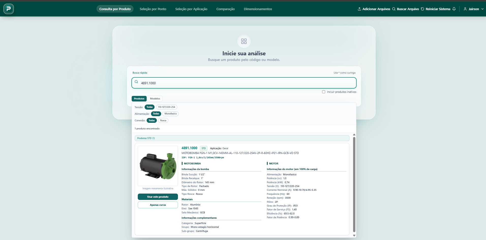

## 4. Seleção por ponto de operação

Neste módulo, o usuário informa a vazão e a altura manométrica requeridas, define tolerâncias e filtros técnicos e consulta as motobombas compatíveis com as condições estabelecidas.

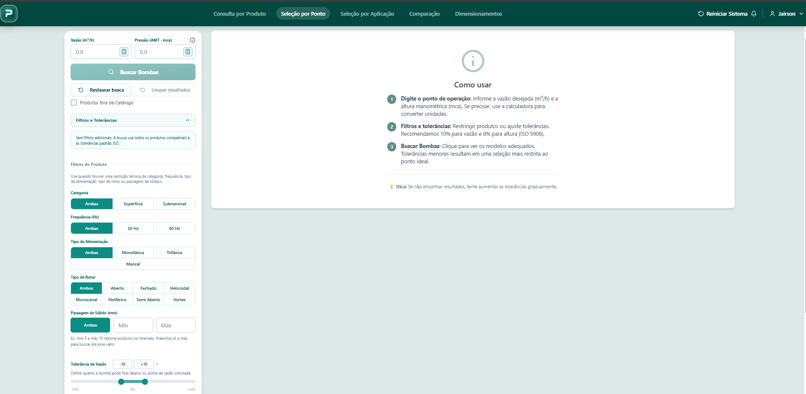

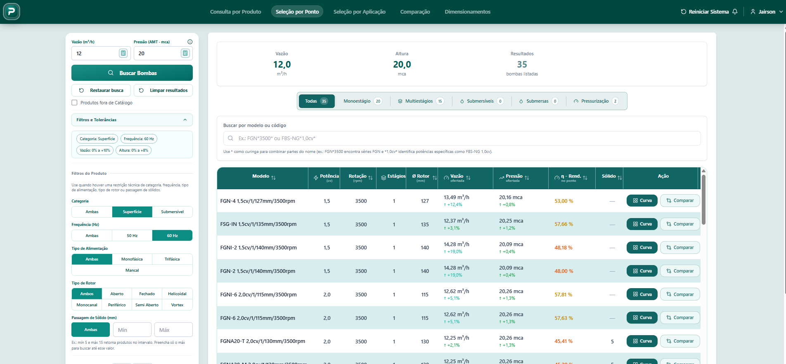

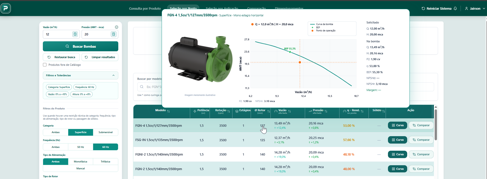

## 5. Seleção por aplicação

A seleção por aplicação conduz o usuário por um fluxo orientado ao cenário informado. O sistema utiliza os dados da aplicação para calcular as condições hidráulicas e localizar alternativas adequadas.

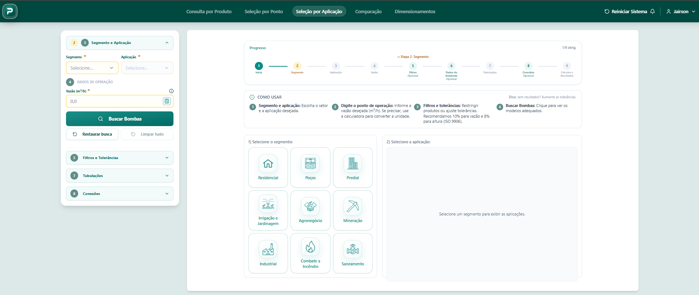

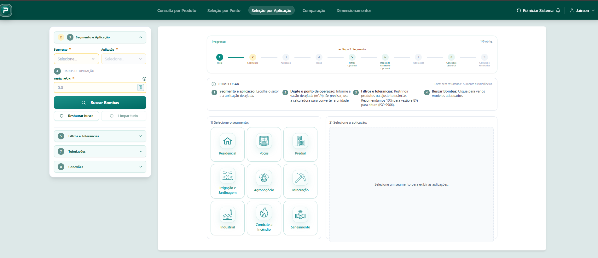

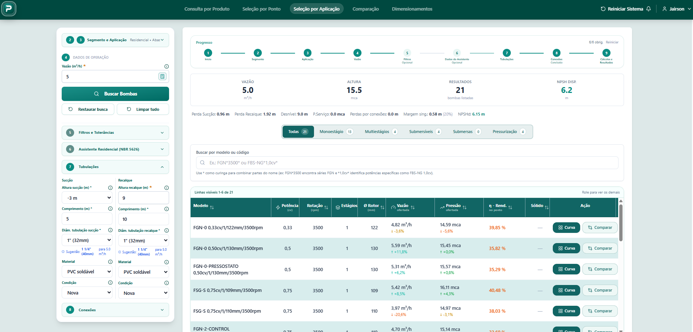

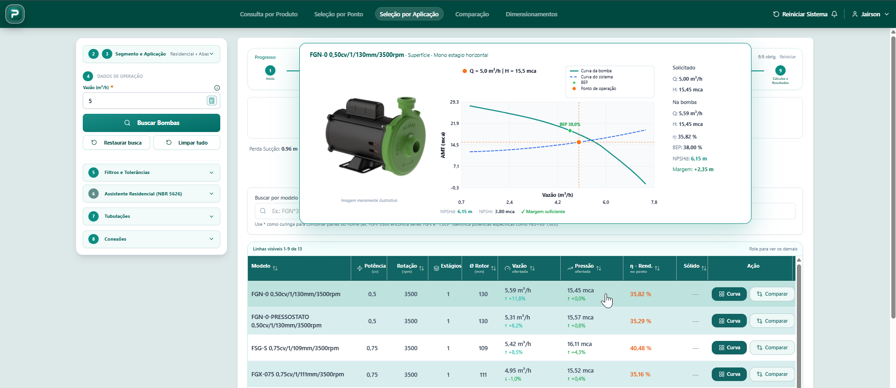

## 6. Análise e ajuste de curvas

A tela de análise reúne gráficos, dados hidráulicos e recursos para avaliar a curva selecionada. Quando aplicável, também permite simular ajustes admitidos pelo sistema.

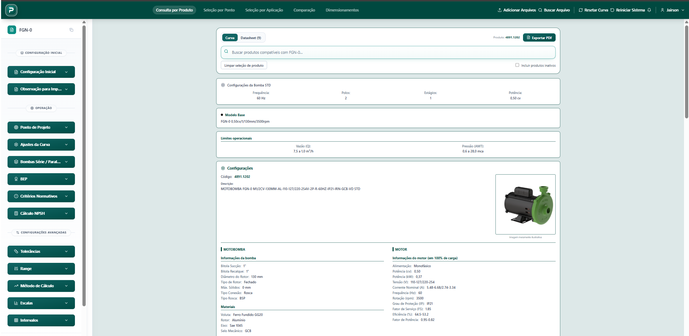

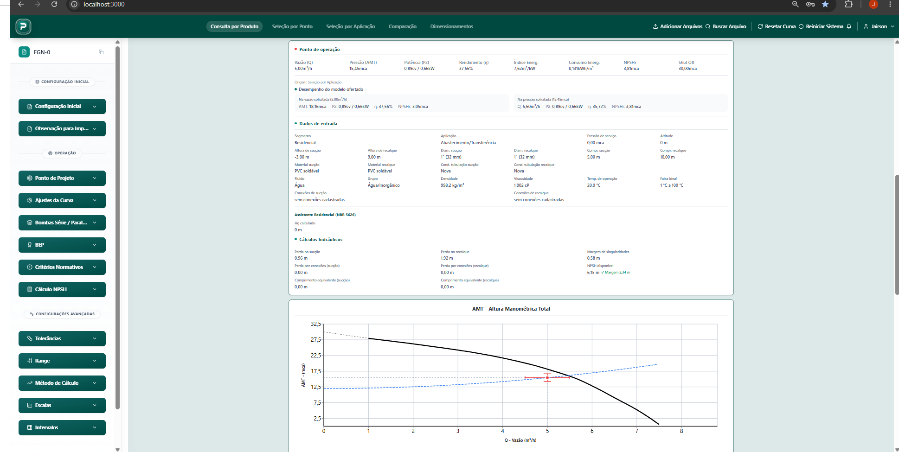

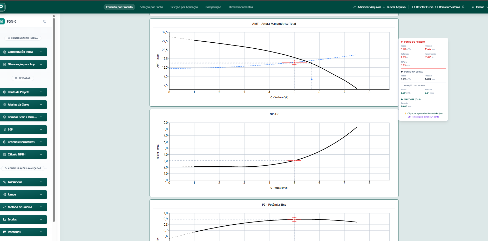

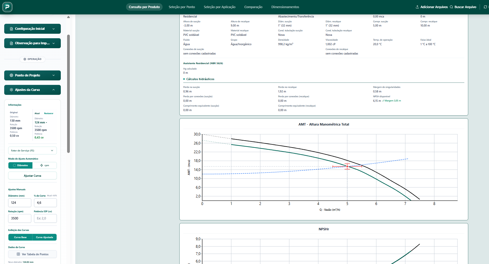

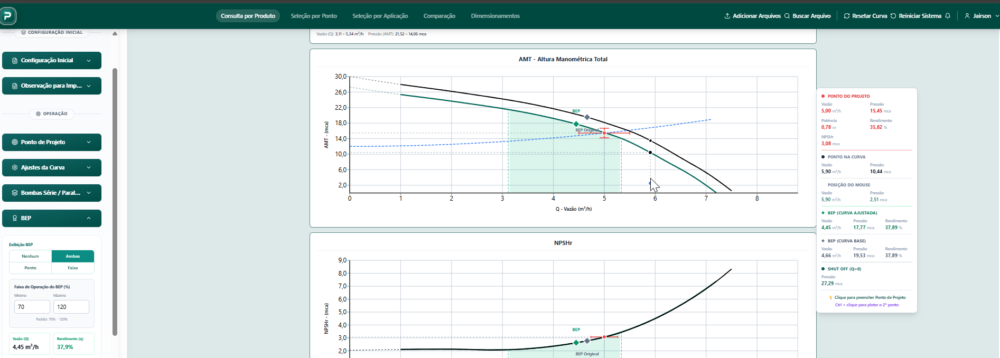

## 7. Comparação de alternativas

O módulo de comparação permite avaliar simultaneamente diferentes motobombas, confrontando curvas, pontos de operação e informações técnicas relevantes para a decisão.

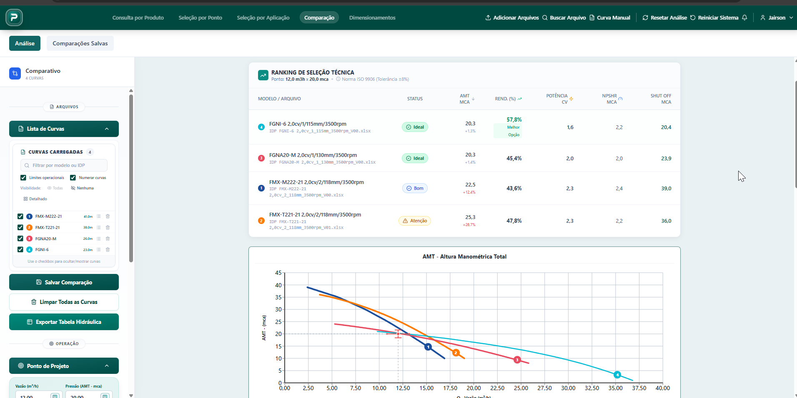

## 8. Trabalhos salvos

Esta área permite salvar, recuperar e consultar dimensionamentos e comparações. Também reúne recursos de autoria, visibilidade, revisões e acesso controlado aos trabalhos.

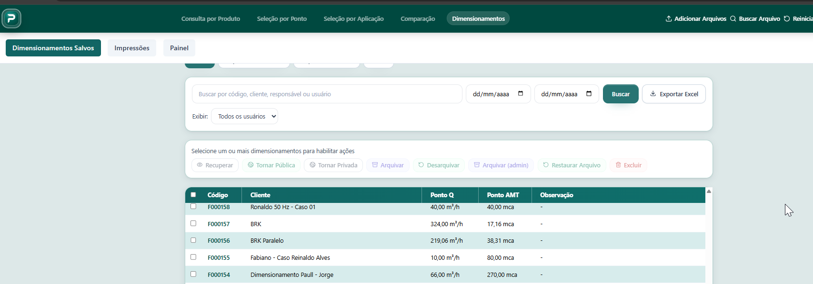

## 9. Relatório técnico

O relatório consolida dados do produto, condições hidráulicas, curvas, resultados e demais informações aplicáveis ao trabalho realizado, seguindo um formato padronizado.

Nesta seção, os resultados são demonstrados por meio de dois documentos gerados pela própria aplicação, sem a utilização de captura de tela.

### 9.1. Seleção por Aplicação

- [Relatório FGN-0 — 0,50 cv, 5,00 m³/h × 15,5 mca](<./arquivo_pdf/FGN-0 0,50cv_1_130mm_3500rpm(5,00m3h X 15,5mca).pdf>)

### 9.2. Seleção por Ponto

- [Relatório FBS-NG-15044A2-100-90 — 15,0 cv, 97,00 m³/h × 20 mca](<./arquivo_pdf/FBS-NG-15044A2-100-90 15,0cv_1_225mm_1750rpm(97,00m3h X 20mca).pdf>)

## Considerações finais

As telas apresentadas demonstram os principais fluxos do PumpCurv, desde o acesso à aplicação e a escolha do módulo até a seleção, a análise e a comparação de motobombas. Os exemplos de relatórios complementam essa visão ao evidenciar a consolidação dos resultados técnicos em documentos padronizados e rastreáveis.
